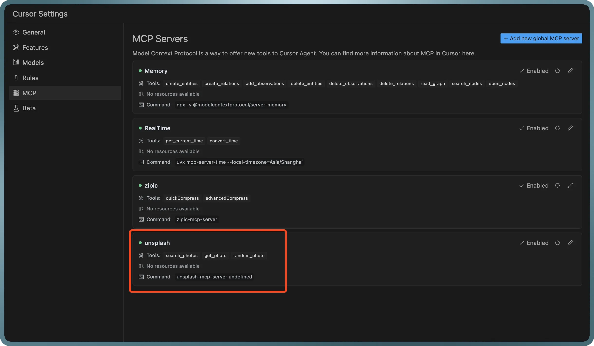
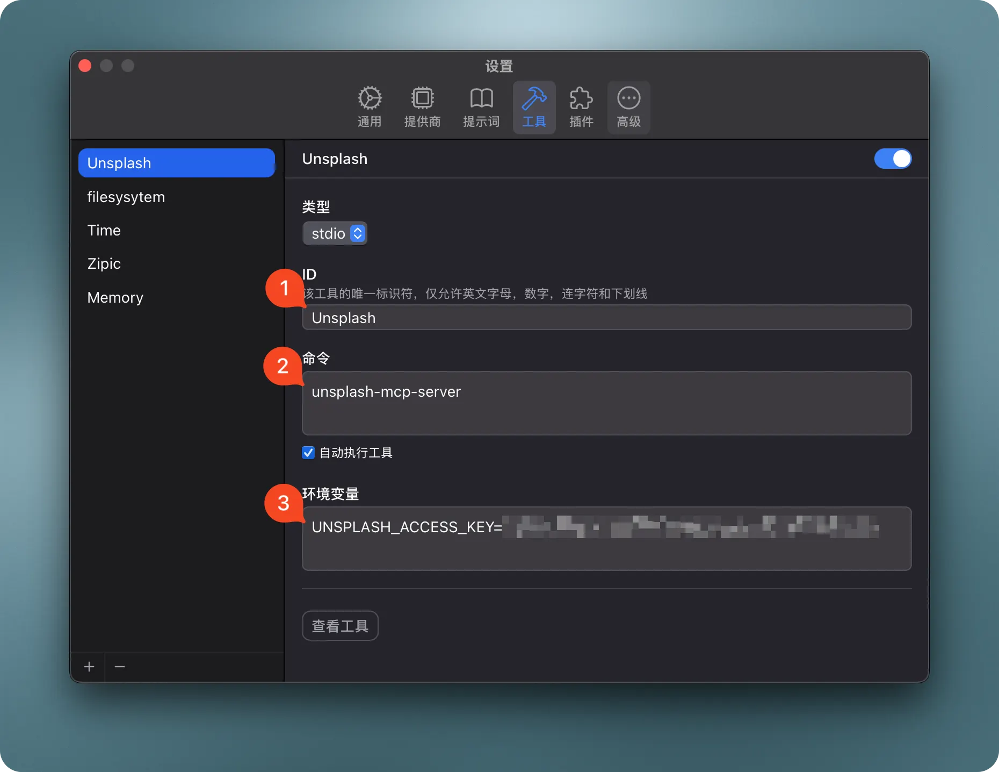

# Unsplash MCP Server

> A Model Context Protocol server that provides Unsplash photo search and retrieval capabilities. This server enables LLMs to search, retrieve, and get random photos from Unsplash's extensive collection. This is a Swift implementation of the [Python version](https://github.com/hellokaton/unsplash-mcp-server), with additional features like `get_photo` and `random_photo`.


## ✨ Features

* **Advanced Image Search**: Search Unsplash's extensive photo library with filters for:
  * Keyword relevance
  * Color schemes
  * Orientation options
  * Custom sorting and pagination
* **Detailed Photo Information**: Get comprehensive details about specific photos including EXIF data, location, and photographer information
* **Random Photo Selection**: Get random photos with flexible filtering options

## Available Tools

* `search_photos` - Search for photos on Unsplash
  * `query` (string, required): Search keyword
  * `page` (number, optional): Page number (1-based), default: 1
  * `perPage` (number, optional): Results per page (1-30), default: 10
  * `orderBy` (string, optional): Sort method (relevant or latest), default: "relevant"
  * `color` (string, optional): Color filter (black_and_white, black, white, yellow, orange, red, purple, magenta, green, teal, blue)
  * `orientation` (string, optional): Orientation filter (landscape, portrait, squarish)

* `get_photo` - Get detailed information about a specific photo
  * `photoId` (string, required): The photo ID to retrieve

* `random_photo` - Get one or more random photos
  * `count` (number, optional): The number of photos to return (Default: 1; Max: 30)
  * `collections` (string, optional): Public collection ID('s) to filter selection. If multiple, comma-separated
  * `topics` (string, optional): Public topic ID('s) to filter selection. If multiple, comma-separated
  * `username` (string, optional): Limit selection to a specific user
  * `query` (string, optional): Limit selection to photos matching a search term
  * `orientation` (string, optional): Filter by photo orientation. Valid values: landscape, portrait, squarish
  * `content_filter` (string, optional): Limit results by content safety. Valid values: low, high
  * `featured` (boolean, optional): Limit selection to featured photos

## Installation

### Option 1: Download Pre-built Binary

1. Download the latest `unsplash-mcp-server` binary from GitHub Releases
2. Make the binary executable:

   ```bash
   chmod +x /path/to/unsplash-mcp-server
   ```

3. Move the binary to a directory in your PATH (optional):

   ```bash
   sudo mv /path/to/unsplash-mcp-server /usr/local/bin/
   ```

### Option 2: Build from Source

1. Clone the repository:

   ```bash
   git clone https://github.com/yourusername/unsplash-mcp-server.git
   cd unsplash-mcp-server
   ```

2. Choose a build option:

   ```bash
   # Option A: Build for Apple Silicon (arm64)
   swift build -c release --arch arm64 -j $(sysctl -n hw.ncpu)

   # Option B: Build for Intel (x86_64)
   swift build -c release --arch x86_64 -j $(sysctl -n hw.ncpu)

   # Option C: Build Universal Binary (both arm64 and x86_64)
   swift build -c release --arch arm64 -j $(sysctl -n hw.ncpu)
   swift build -c release --arch x86_64 -j $(sysctl -n hw.ncpu)
   mkdir -p .build/bin
   lipo -create \
     -output .build/bin/unsplash-mcp-server \
     $(swift build -c release --arch arm64 --show-bin-path)/unsplash-mcp-server \
     $(swift build -c release --arch x86_64 --show-bin-path)/unsplash-mcp-server
   ```

3. Install the binary (optional):

   ```bash
   # After building, choose ONE of these commands based on your build choice:
   # If you built for arm64 (Option A):
   sudo cp .build/apple/Products/Release/unsplash-mcp-server /usr/local/bin/
   # If you built for x86_64 (Option B):
   sudo cp .build/x86_64-apple-macosx/release/unsplash-mcp-server /usr/local/bin/
   # If you built universal binary (Option C):
   sudo cp .build/bin/unsplash-mcp-server /usr/local/bin/
   ```

## Configuration

### Environment Variables

The server requires an Unsplash API access key to function. Set it in your environment:

```bash
export UNSPLASH_ACCESS_KEY="your-access-key-here"
```

### Configure for Claude.app

Add to your Claude settings:

```json
"mcpServers": {
  "unsplash": {
    "command": "unsplash-mcp-server"
  }
}
```

### Configure for Cursor

Add the following configuration to your Cursor editor's `settings.json`:

```json
{
  "mcpServers": {
    "unsplash": {
      "command": "unsplash-mcp-server",
      "env": {
        "UNSPLASH_ACCESS_KEY": "${YOUR_ACCESS_KEY}"
      }
    }
  }
}
```



### Configure for Chatwise



### Use in Chatwise

## Development Requirements

* Swift 6.0 or later
* macOS 14.0 or later
* Unsplash API access key
* MCP Swift SDK 0.2.0 or later

## Version History

See GitHub Releases for version history and changelog.

## License

unsplash-mcp-server is licensed under the MIT License. This means you are free to use, modify, and distribute the software, subject to the terms and conditions of the MIT License. For more details, please see the LICENSE file in the project repository.
