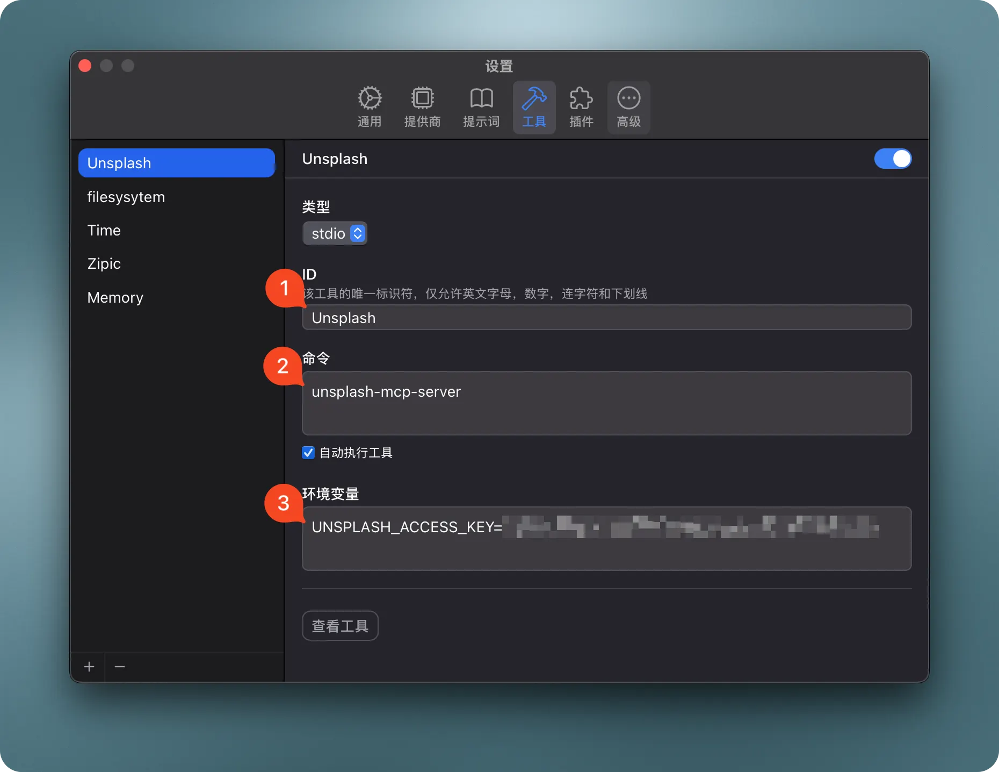

# Unsplash MCP Server

> A Model Context Protocol server that provides Unsplash photo search and retrieval capabilities. This server enables LLMs to search, retrieve, and get random photos from Unsplash's extensive collection. This is a Go implementation that offers tools like `search_photos`, `get_photo`, and `random_photo`.


## ✨ Features

* **Advanced Image Search**: Search Unsplash's extensive photo library with filters for:
  * Keyword relevance
  * Color schemes
  * Orientation options
  * Custom sorting and pagination
* **Detailed Photo Information**: Get comprehensive details about specific photos including EXIF data, location, and photographer information
* **Random Photo Selection**: Get random photos with flexible filtering options
* **Multiple Connection Modes**:
  * Standard I/O mode for direct integration with LLMs
  * Server-Sent Events (SSE) mode for web-based connections

## Available Tools

* `search_photos` - Search for photos on Unsplash
  * `query` (string, required): Search keyword
  * `page` (number, optional): Page number (1-based), default: 1
  * `per_page` (number, optional): Results per page (1-30), default: 10
  * `order_by` (string, optional): Sort method (relevant or latest), default: "relevant"
  * `color` (string, optional): Color filter (black_and_white, black, white, yellow, orange, red, purple, magenta, green, teal, blue)
  * `orientation` (string, optional): Orientation filter (landscape, portrait, squarish)

* `get_photo` - Get detailed information about a specific photo
  * `photoId` (string, required): The photo ID to retrieve

* `random_photo` - Get one or more random photos
  * `count` (number, optional): The number of photos to return (Default: 1; Max: 30)
  * `collections` (string, optional): Public collection ID('s) to filter selection. If multiple, comma-separated
  * `topics` (string, optional): Public topic ID('s) to filter selection. If multiple, comma-separated
  * `username` (string, optional): Limit selection to a specific user
  * `query` (string, optional): Limit selection to photos matching a search term
  * `orientation` (string, optional): Filter by photo orientation. Valid values: landscape, portrait, squarish
  * `content_filter` (string, optional): Limit results by content safety. Valid values: low, high
  * `featured` (boolean, optional): Limit selection to featured photos

## Installation

### Option 1: Download Pre-built Binary

Download the latest pre-built binary for your platform from the [GitHub Releases](https://github.com/yourusername/unsplash-mcp-server-go/releases/latest) page and follow the installation instructions below.

<details>
<summary><b>macOS Installation</b></summary>

#### macOS with Apple Silicon (M1/M2/M3):
```bash
# Download the arm64 version
curl -L https://github.com/yourusername/unsplash-mcp-server-go/releases/latest/download/unsplash-mcp-server-macos-arm64.zip -o unsplash-mcp-server.zip
unzip unsplash-mcp-server.zip
chmod +x unsplash-mcp-server

# Remove quarantine attribute to avoid security warnings
xattr -d com.apple.quarantine unsplash-mcp-server

# Install to your local bin directory
mkdir -p ~/.local/bin
mv unsplash-mcp-server ~/.local/bin/
rm unsplash-mcp-server.zip
```

#### macOS with Intel Processor:
```bash
# Download the x86_64 version
curl -L https://github.com/yourusername/unsplash-mcp-server-go/releases/latest/download/unsplash-mcp-server-macos-x86_64.zip -o unsplash-mcp-server.zip
unzip unsplash-mcp-server.zip
chmod +x unsplash-mcp-server

# Remove quarantine attribute to avoid security warnings
xattr -d com.apple.quarantine unsplash-mcp-server

# Install to your local bin directory
mkdir -p ~/.local/bin
mv unsplash-mcp-server ~/.local/bin/
rm unsplash-mcp-server.zip
```

#### macOS Universal Binary (works on both Apple Silicon and Intel):
```bash
# Download the universal version
curl -L https://github.com/yourusername/unsplash-mcp-server-go/releases/latest/download/unsplash-mcp-server-macos-universal.zip -o unsplash-mcp-server.zip
unzip unsplash-mcp-server.zip
chmod +x unsplash-mcp-server

# Remove quarantine attribute to avoid security warnings
xattr -d com.apple.quarantine unsplash-mcp-server

# Install to your local bin directory
mkdir -p ~/.local/bin
mv unsplash-mcp-server ~/.local/bin/
rm unsplash-mcp-server.zip
```
</details>

<details>
<summary><b>Linux Installation</b></summary>

#### Linux on x86_64 (most common):
```bash
# Download the amd64 version
curl -L https://github.com/yourusername/unsplash-mcp-server-go/releases/latest/download/unsplash-mcp-server-linux-amd64.tar.gz -o unsplash-mcp-server.tar.gz
tar -xzf unsplash-mcp-server.tar.gz
chmod +x unsplash-mcp-server

# Install to your local bin directory
mkdir -p ~/.local/bin
mv unsplash-mcp-server ~/.local/bin/
rm unsplash-mcp-server.tar.gz
```

#### Linux on ARM64 (e.g., Raspberry Pi 4, AWS Graviton):
```bash
# Download the arm64 version
curl -L https://github.com/yourusername/unsplash-mcp-server-go/releases/latest/download/unsplash-mcp-server-linux-arm64.tar.gz -o unsplash-mcp-server.tar.gz
tar -xzf unsplash-mcp-server.tar.gz
chmod +x unsplash-mcp-server

# Install to your local bin directory
mkdir -p ~/.local/bin
mv unsplash-mcp-server ~/.local/bin/
rm unsplash-mcp-server.tar.gz
```
</details>

<details>
<summary><b>Windows Installation</b></summary>

#### Windows on x86_64 (most common):
- Download the [Windows AMD64 version](https://github.com/yourusername/unsplash-mcp-server-go/releases/latest/download/unsplash-mcp-server-windows-amd64.zip)
- Extract the ZIP file
- Move the `unsplash-mcp-server.exe` to a location in your PATH

#### Windows on ARM64 (e.g., Windows on ARM devices):
- Download the [Windows ARM64 version](https://github.com/yourusername/unsplash-mcp-server-go/releases/latest/download/unsplash-mcp-server-windows-arm64.zip)
- Extract the ZIP file
- Move the `unsplash-mcp-server.exe` to a location in your PATH
</details>

Make sure the installation directory is in your PATH:

- **macOS/Linux**: Add `export PATH="$HOME/.local/bin:$PATH"` to your shell configuration file (`.bashrc`, `.zshrc`, etc.)
- **Windows**: Add the directory to your system PATH through the System Properties > Environment Variables dialog

### Option 2: Build from Source

1. Clone the repository:

   ```bash
   git clone https://github.com/yourusername/unsplash-mcp-server-go.git
   cd unsplash-mcp-server-go
   ```

2. Build the project:

   **Using Make (recommended):**
   ```bash
   # Build for your current platform
   make

   # Or build for a specific platform
   make build-darwin-universal    # macOS Universal Binary
   make build-darwin-arm64        # macOS Apple Silicon
   make build-darwin-amd64        # macOS Intel
   make build-linux-amd64         # Linux x86_64
   make build-linux-arm64         # Linux ARM64
   make build-windows-amd64       # Windows x86_64

   # Or build for all platforms at once
   make build-all

   # Create distribution packages for all platforms
   make dist
   ```

   The binaries will be placed in the `.build` directory.

   **Using Go directly:**
   ```bash
   go build -o unsplash-mcp-server
   ```

3. Install the binary:

   ```bash
   # Install to user directory (recommended, no sudo required)
   mkdir -p ~/.local/bin
   cp unsplash-mcp-server ~/.local/bin/
   ```

   Make sure `~/.local/bin` is in your PATH by adding to your shell configuration file:

   ```bash
   echo 'export PATH="$HOME/.local/bin:$PATH"' >> ~/.zshrc  # or ~/.bashrc
   source ~/.zshrc  # or source ~/.bashrc
   ```

## Configuration

### Environment Variables

The server requires an Unsplash API access key to function. Set it in your environment:

```bash
export UNSPLASH_ACCESS_KEY="your-access-key-here"
```

* Unsplash API Access Key (register at [Unsplash Developers Portal](https://unsplash.com/developers))

### Obtain an Unsplash API Access Key

1. Go to the [Unsplash Developers Portal](https://unsplash.com/developers)
2. Sign up or log in to your Unsplash account
3. Register a new application
4. Accept the API use and guidelines
5. Fill in your application details (name, description, etc.)
6. Once registered, you'll receive your Access Key (also called Client ID)

### Configure for Claude.app

Add to your Claude settings:

```json
"mcpServers": {
  "unsplash": {
    "command": "unsplash-mcp-server",
    "env": {
      "UNSPLASH_ACCESS_KEY": "your-access-key-here"
    }
  }
}
```

### Configure for Cursor

Add the following configuration to your Cursor editor's `settings.json`:

```json
{
  "mcpServers": {
    "unsplash": {
      "command": "unsplash-mcp-server",
      "env": {
        "UNSPLASH_ACCESS_KEY": "your-access-key-here"
      }
    }
  }
}
```

### Configure for Chatwise



> **Note**: When adding environment variables in Chatwise, do not wrap the value in quotes (fixes #1)

### Use in Chatwise

<video src="https://github.com/user-attachments/assets/ade1e290-3c95-4561-aa32-fa3a729160c4" controls></video>

## Command Line Arguments

The server supports the following command line arguments:

* `-h, --help`: Display help information about the server, its usage, and available options
* `-v, --version`: Display the version number of the unsplash-mcp-server
* `-t, --transport <string>`: Transport type to use (default: "stdio")
  * `stdio`: Standard input/output mode for direct integration with LLMs
  * `sse`: Server-Sent Events mode for web-based connections
* `-p, --port <int>`: Port to use when running in SSE mode (default: 8080)

Example usage:

```bash
# Display help information
unsplash-mcp-server --help

# Display version information
unsplash-mcp-server --version

# Start server with default settings (stdio mode)
unsplash-mcp-server

# Start server in SSE mode on the default port (8080)
unsplash-mcp-server --transport sse

# Start server in SSE mode on a custom port
unsplash-mcp-server --transport sse --port 9090
```

When running in SSE mode, the server will be accessible via HTTP on the specified port, allowing web-based clients to connect. In stdio mode (default), the server communicates through standard input/output, which is ideal for direct integration with LLM applications.

## Example System Prompt

You can use the following system prompt to help Claude utilize the unsplash-mcp-server effectively:

```
You have access to Unsplash photo search tools through MCP. You can:

1. Search for photos using specific keywords, colors, or orientations:
   - Use the search_photos tool to find images on any topic
   - Filter by color or orientation as needed
   - You can page through results and control how many appear per page

2. Get detailed information about specific photos:
   - Use get_photo with a photo ID to retrieve comprehensive details
   - This includes EXIF data, location info, and photographer details

3. Fetch random photos with customizable filters:
   - Use random_photo tool to get surprise images based on criteria
   - Filter random selections by topic, collection, username, etc.

When the user asks for images, use these tools to find relevant Unsplash photos.
Include photo URLs in your responses so users can view the images.
```

## Development Requirements

* Go 1.20 or later
* Unsplash API access key
* MCP Go SDK 0.19.0 or later

## Usage Examples

### Searching for Photos

```json
{
  "query": "mountain landscape",
  "per_page": 5,
  "color": "blue",
  "orientation": "landscape"
}
```

### Getting Photo Details

```json
{
  "photoId": "Dwu85P9SOIk"
}
```

### Getting Random Photos

```json
{
  "count": 3,
  "query": "coffee",
  "orientation": "portrait"
}
```

## Version History

See GitHub Releases for version history and changelog.

### ☕️ Support the Project

If you find unsplash-mcp-server useful, please consider supporting its development:

* ⭐️ Star the project on GitHub
* 🐛 Report bugs or suggest features in the issue tracker
* 🔄 Submit pull requests to help improve the code
* 💝 Support via:

<p align="center">
  <a href="https://buymeacoffee.com/okooo5km">
    
  </a>
</p>

## License

unsplash-mcp-server-go is licensed under the MIT License. This means you are free to use, modify, and distribute the software, subject to the terms and conditions of the MIT License. For more details, please see the LICENSE file in the project repository.
